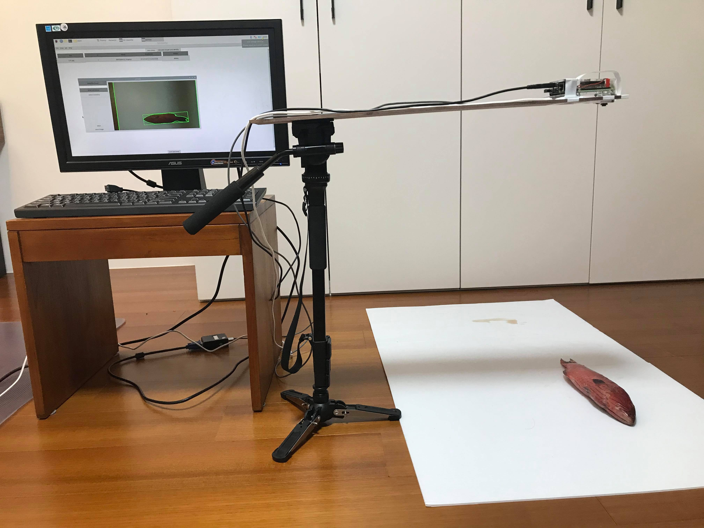

# NTNU-EE-Project
台師大電機系專題:結合深度學習及影像處理技術之魚類辨識、長度計算系統

# Device

# Demo(gui)
[Download GUI Demo Video](gui_demo_v.mp4)

# Demo(webpage)
[Download Webpage Demo Video](webpage_demo_v.mp4)

# Link
* [Poster](專題競賽海報v1.pptx)
* [Slide](電機專題報告v2.pptx)
* [Report](專題書面報告final.docx)
